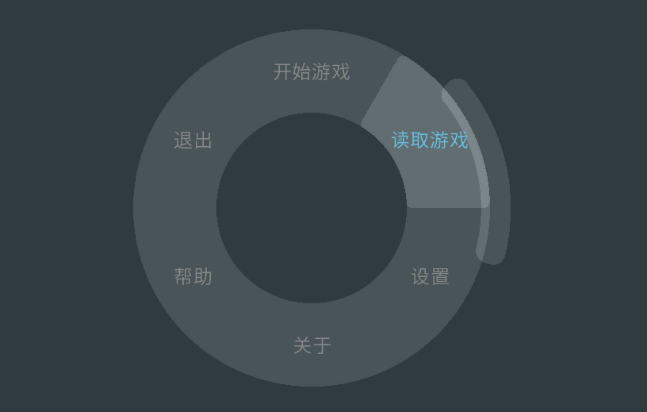

# CircleMenu

圆盘布局与圆盘菜单组件

使用例请见目录下 Sample

演示视频: https://www.bilibili.com/video/BV1QapczfEVk

---

# 组件:

## 圆盘布局 - circle_layout

通过继承 Container 类进行编写的类型, 有两个参数

| 参数名 | 数据类型 | 描述 | 默认值 |
| -------------------- | ---- | ---- | --- |
| offset_angle | float | 偏移角度 | 0.0 |
| r | int | 半径 | 200 |

## 圆盘菜单 - circle_menu

通过继承 circle_layout 进行编写的菜单

同样是对每一个子组件进行圆盘样的布局, 但是添加了选择的功能, 选中的子组件类型若为 Button 及其子组件则会触发此组件的 clicked callback ( 也就是此组件的 action )

此组件有五个参数

| 参数名 | 数据类型 | 描述 | 默认值 |
| -------------------- | ---- | ---- | ---- |
| offsets_angle | float | 偏移角度 | 0.0 |
| r | int | 布局半径 | 230 |
| mouse_check_r | int | 检查鼠标事件的半径范围 ( r_min, r_max ), 超出此范围的不检查鼠标事件 ( 用于优化 ) | (160, 300) |
| callbacks | dict[str: Iterable[Function] \| Function] | 回调函数字典 | dict() |
| config | dict[str: Iterable[Function] \| Function] | 配置项字典 | dict() |
| key | dict[str: Iterable[Function] \| Function] | 按键触发字典 | dict() |

( callbacks, config, key 的是为了复用设计的 )

---

# 默认配置项与参数配置

## Callback Dict

| 键 | 函数传参 | 描述 | 默认值 |
| ---- | -------- | -------- | ---- |
| render | self, rv, w, h, st, at | 渲染函数回调 | None |  
| event | self, ev, x, y, st | 事件函数回调 | None |
| motion | self, ev, x, y, st, rad *(鼠标所在弧度)* | 鼠标移动回调 | None |
| is_active | self, ev, x, y, st | 用于判断当前事件是否激活了选项 | None |
| active | self: CircleMenu obj: Displayable (选中项) index: int (选中项下标) | 事件激活回调 | None |
| solve_select | self: CircleMenu st: int (时间轴) | 处理当前选择的子对象的下标 | None |
| apply_focus | self: CircleMenu (菜单对象) selected: Displayable ( 当前 focus ) last: Displayable ( 上一个 focus ) index: tuple[int, int] ( 当前/上一个 focus 的下标 ) | 将 focus 应用到对象时的回调, 仅在 focus 改变时调用 | None |
    

## Config Dict

| 键 | 描述 | 默认值 |
| ---- | -------- | ---- |
| mouse_motion | 启用鼠标移动选择选项 | True |
| mouse_wheel | 启用鼠标滚轮选择选项 | True |
| keyboard | 启用键盘选择选项 | True |
| mouse_active | 启用鼠标左键确认选项 | True |
| keyboard_active | 启用键盘按键确认选项 | True |
| clean_focus | 清除掉原本按钮的 focus, 关掉的话键盘的上下左右可以按照标准 renpy 布局的方法来进行选择 | True |
| limit_event | 限制事件只能在 mouse_check_r 的外半径内被处理 | False |

## Key Dict
| 键 | 描述 | 默认值 |
| ---- | -------- | ---- |
| next | 键盘下一个按钮的按键映射 | pygame.K_RIGHT pygame.K_DOWN pygame.K_d pygame.K_s pygame.K_KP_2 pygame.K_KP_6 |
| last | 键盘上一个按钮的按键映射 | pygame.K_LEFT pygame.K_UP pygame.K_a pygame.K_w pygame.K_4 pygame.K_8 |
| active | 激活选项的键盘按键 | pygame.K_KP_ENTER pygame.K_SPACE |

    