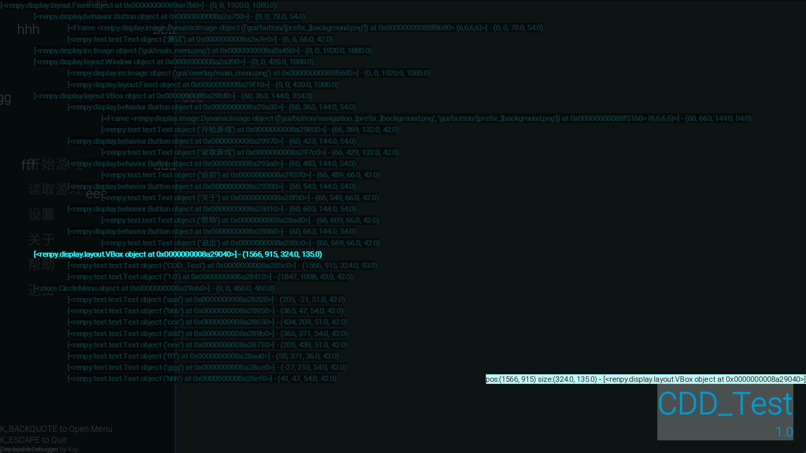

# RenderDebugger

访问 Renpy 渲染树层级对每一个 Render 的位置进行查找的工具

演示视频: https://www.bilibili.com/video/BV1WvkXBtEkj/

---

默认按键:

-   按  `  打开菜单, 在菜单内按会打开子菜单
-   esc 退出菜单

---

# 菜单功能

## Screen

-   layer:	选择 Debugger 的图层
-   SLE:	选择此图层里面的组件

## Debuugger

-   图像预览置顶
-   选中项信息置顶
-   鼠标滚动行数
-   字体大小
-   显示间隔

## Color

内置了五种配色组

-   默认
-   青色
-   透明
-   暗色
-   亮色

细则配色下面也可以调整, 也可以通过修改 debugger_color.json 添加配色