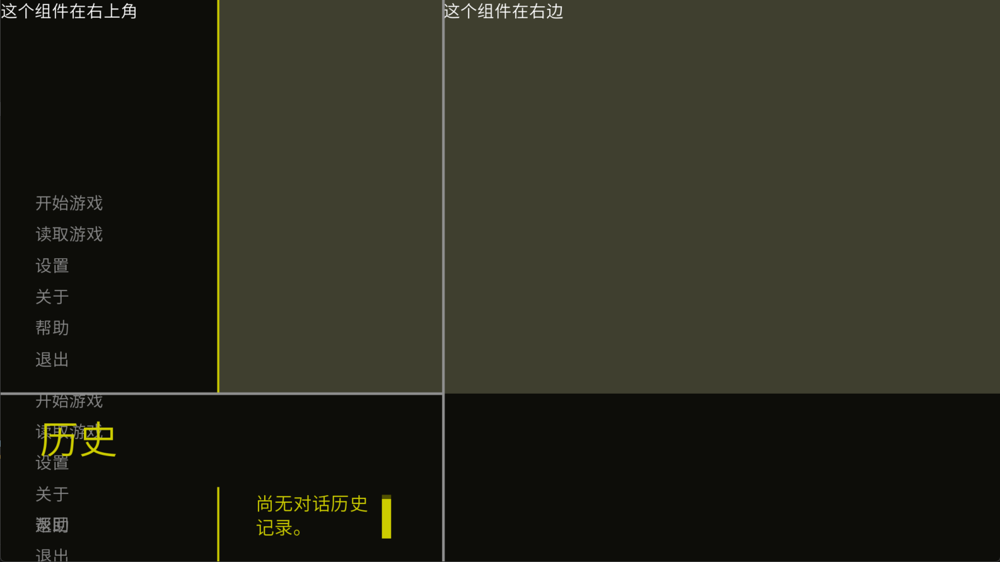

# SplitLayout

分割线容器组件, 可以用一条线把界面分成两半进行布局

---

此组件有以下参数:

| 参数名 | 数据类型 | 描述 | 默认值 |
| -------------------- | ---- | ---- | ---- |
| max_percent | float | 最大的百分度 ( 是的是按照百分比计算而不是像素 ) | 0.9 |
| min_percent | float | 最小的百分度 | 0.1 |
| default_percent | float | 初始的百分度 | 0.5 |
| render_limit | bool | 是否按照分割后的大小渲染子组件 (不然就以 SplitLayout 的大小进行渲染) | True |
| event_limit | bool | 是否只把 event 传入一个子组件 (不然同一个 event 能被两个子组件接收) | True |
| horizontal_nor_vertical | bool | 纵或横向布局, True 为横 | True |
| divider_width | int | 条渲染的宽度 | 3 |
| divider_border | int | 条判定的宽度 | 10 |
| divider_draggable | bool | 条是否可拖动 | True |
| divider_idle | Iterable[int, int, int, ...] | 条的 idle 颜色, RGB 通道 | (144, 144, 144) |
| divider_hover | Iterable[int, int, int, ...] | 条的 hover 颜色, RGB 通道 | (100, 160, 210) |
| divider_select | Iterable[int, int, int, ...] | 条的 select 颜色, RGB 通道 | (90, 180, 255) |

