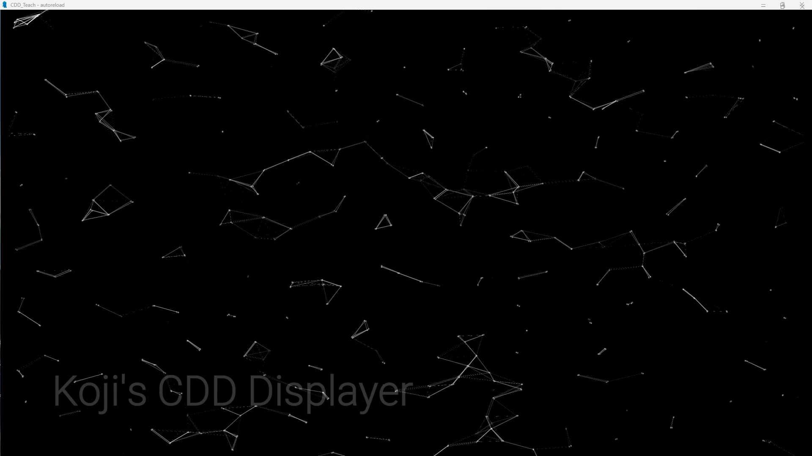

# CloudNode

---

点云图组件

现在看, 写的挺烂的, 不过既然做好视频而且都丢到仓库里了, 那也没有再移除出去的必要了, 顺便补一个说明

此组件有以下参数

| 参数名 | 数据类型 | 描述 | 默认值 |
| -------------------- | ---- | ---- | ---- |
| color | Iterable[float, float, float, float] | 点颜色, 浮点 rgba | (1.0, 1.0, 1.0, 0.0) |
| node_dead_time | float | 点消除时间 | 3.0 |
| link_length | float | 边连接的长度 | 0.05 |
| line_width | float | 边的渲染宽度 | 0.1 |
| mouse_r | float | 鼠标吸附的停靠半径 | 0.04 |
| mouse_R | float | 鼠标吸附的半径 | 0.15 |
| mouse_w | float | 鼠标范围内点运动的强度 | 1.0 |
| mouse_k | float | 鼠标吸附效果的强度 | 1.0 |
| mouse_f | float | 惯性对点影响的强度 | 0.25 |
| node_add_speed | float | 点生成速度 | 60.0 |
| node_size | Iterable[int, int] | 点渲染大小 | (5, 5) |

