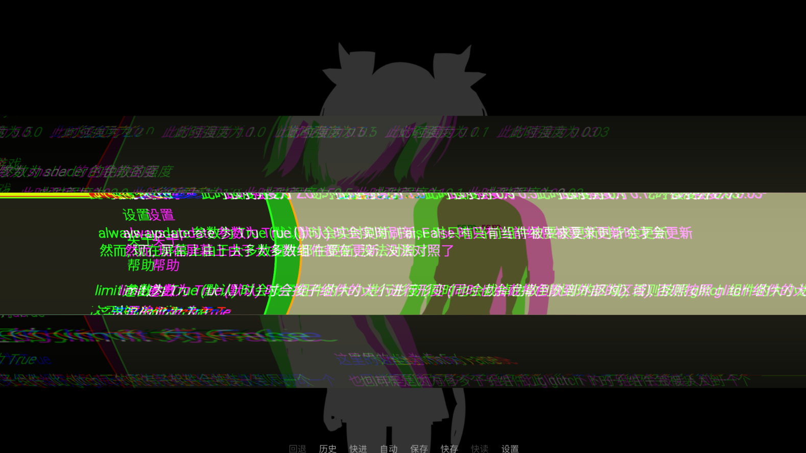

# Glitch

---

简易的画面扭曲效果

此组件有以下参数:

| 参数名 | 数据类型 | 描述 | 默认值 |
| -------------------- | ---- | ---- | ---- |
| density | float | 扭曲的密度 | 1.0 |
| intensity | float | 扭曲的强度 | 1.0 |
| dispersion | float | 色散的强度 | 1.0 |
| always_update | bool | 是否始终更新 | True |
| limit | bool | 是否限制扭曲区域为子组件大小 | True |

 此外这个效果可以用于转场, 作为转场时不接受参数

