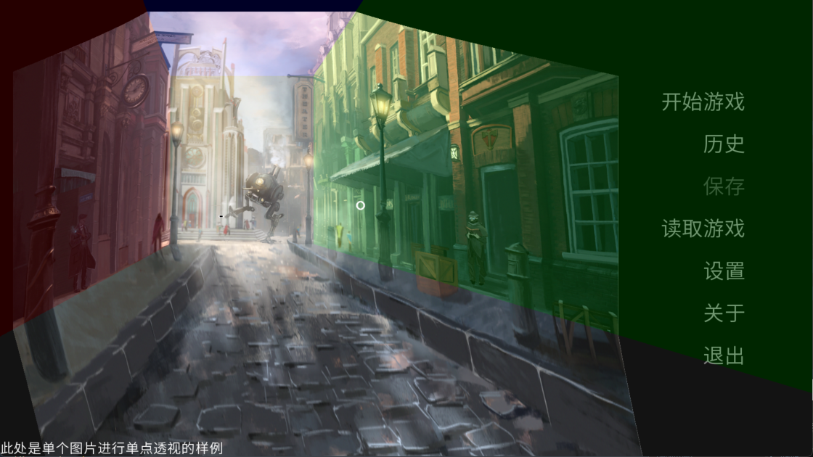

# Perspective

*( 原计划是二点与三点透视组件都写出来的, 但是组织与调用难度都太高了因此只写了一点透视 )*

*( 现在的调用方法还是太烂了, 也许哪天我会写成 transform 的调用这样用起来就很方便了 )*

一点透视组件与相关控制组件

---

## OnePointPerspective

一点透视组件, 此组件有以下参数

| 参数名 | 数据类型 | 描述 | 默认值 |
| -------------------- | ---- | ---- | --- |
| texture | Displayable | 固定传参, 透视的纹理图像 |  |
| mask_center | Iterable[float, float] | 纹理透视中心, 按百分比描述坐标 | (0.5, 0.5) |
| mask_area | Iterable[float, float, float, float] | 纹理中心区域, 按百分比描述区域 | (0.4, 0.6, 0.4, 0.6) |
| center | None \| Iterable[float, float] | 转换透视中心, None 则为 mask | None |
| area | None \| Iterable[float, float, float, float] | 转换中心区域, None 则为 mask | None |
| intensity | float | 透视拉伸强度 | 1.0 |
| render_size | None \| Iterable[int, int] | 渲染大小 | None |
| always_update | bool | 保持刷新 | True |
| enable_debug | bool | 开启 Debug 信息显示 | False |
| ignore_area | Iterable[bool, bool, bool, bool] | 忽略某块区域的渲染 (左, 右, 上, 下) | (False, False, False, False) |
| ignore_center | bool | 忽略掉中心区域的渲染 | False |
| addin | Iterable[BaseAddin] | 辅助控制插件 | () |

## 预设的辅助控制插件

### ResetArgAddin

重置参数插件, 用于情况上一次插件更新的状态

无参数

### CenterMouseTrackAddin

根据鼠标位置形变 Center 插件

| 参数名 | 数据类型 | 描述 | 默认值 |
| -------------------- | ---- | ---- | ---- |
| center | Iterable[float float] | 形变的 center 坐标 | (1.0, 1.0) |
| catch_fullscreen | bool | 是否以全屏为坐标系作为鼠标位置参考 | False |
| mode | int | 形变混合方式, 0(与其他): 加算, 1: 乘算, 2: 加上乘算结果, 3: 覆盖 | 2 |

### AreaMouseTrackAddin

根据鼠标位置形变 Area 的插件

| 参数名 | 数据类型 | 描述 | 默认值 |
| -------------------- | ---- | ---- | ---- |
| area | Iterable[float, float, float float] | 形变的 area 区域 | (1.0, 1.0, 1.0, 1.0) |
| catch_fullscreen | bool | 是否以全屏为坐标系作为鼠标位置参考 | False |
| mode | int | 形变混合方式, 同上 | 2 |

### IntensityAddin

根据鼠标滚轮形变 Intensity 插件

| 参数名 | 数据类型 | 描述 | 默认值 |
| -------------------- | ---- | ---- | ---- |
| intensity | float | 单次缩放的倍率 | 0.1 |
| count | int | 当前倍率的次数 | 10 |
| limit | Iterable[float, float] | 缩放倍率的范围 | (0.1, 1.2) |
| speed | float | 缩放变换的速度 | 10 |
| mode | int | 形变混合方式, 同上 | 3 |

### ScaleAreaAddin

根据鼠标滚轮形变 Area 插件

| 参数名 | 数据类型 | 描述 | 默认值 |
| -------------------- | ---- | ---- | ---- |
| area | float | 单次缩放的倍率 | 0.1 |
| count | int | 当前倍率的次数 | 0 |
| limit_count | Iterable[float, float] | 缩放倍率的范围 | (-10, 2) |
| speed | float | 缩放变换的速度 | 10 |
| mode | int | 形变混合方式, 同上 | 0 |

---

# 辅助控制插件

## BaseAddin

 辅助控制插件的基类,  无传参纯粹声明定义, 该基类有以下方法需要重载

### def event(self, obj, ev, x, y, st)

当透视组件触发事件时插件的回调函数

| 参数名 | 数据类型            | 描述                    |
| ------ | ------------------- | ----------------------- |
| obj    | OnePointPerspective | 此 Addin 控制的透视组件 |
| ev     | Event               | 触发的事件参数          |
| x      | int                 | 触发的 x                |
| y      | int                 | 触发的 y                |
| st     | float               | 触发的 st               |
| at     | float               | 触发的 at               |

### def render(self, obj, w, h, st, at)

当透视组件触发渲染时插件的回调函数

| 参数名 | 数据类型            | 描述                    |
| ------ | ------------------- | ----------------------- |
| obj    | OnePointPerspective | 此 Addin 控制的透视组件 |
| ev     | Event               | 触发的事件参数          |
| w      | int                 | 渲染的 w                |
| h      | int                 | 渲染的 h                |
| st     | float               | 触发的 st               |
| at     | float               | 触发的 at               |

