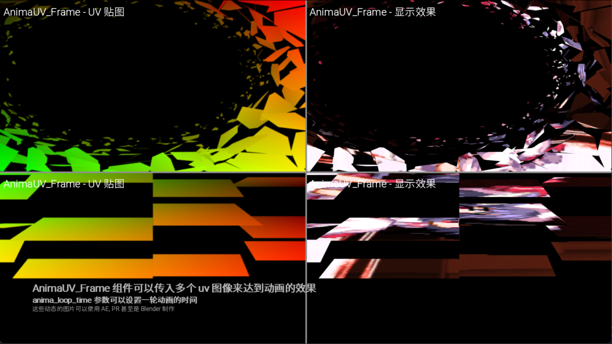

# UV_Frame

根据本地渲染的 UV 图像对图像进行变换的组件

---

## SingleUV_Frame

将单个 UV 图像作用到 可视组件 上

| 参数名 | 数据类型 | 描述 | 默认值 |
| -------------------- | ---- | ---- | ---- |
| image | Displayable \| str | 应用的可视化组件, 固定传参 |  |
| uv | Displayable \| str | UV 图像文件路径或者可视组件, 固定传参 |  |
| sample_dis | float | 采样插值值 | 0.005 |
| alpha_pow | float | 透明通道的乘方 | 3.0 |
| sample_level | int | 采样方法 | 3 |
| load_cache | bool | 初始化时载入缓存 | True |
| render_image_size | bool | 是否按照应用的组件的大小作为渲染大小 | True |
| anisotropic | bool | 是否开启抗锯齿 ( 但是我用起来没什么差别 ) | True |
| blend_alpha | bool | 是否使用 UV 图像 alpha 通道 | False |
| only_uv | bool | 仅显示 uv 图像 | False |

## AnimaUV_Frame

将多个 UV 图像应用到 可视组件 上

| 参数名 | 数据类型 | 描述 | 默认传参 |
| -------------------- | ---- | ---- | ---- |
| image | Displayable \| str | 应用的可视化组件, 固定传参 |  |
| uv_files | Iterable[Displayable \| str] | UV 图像文件路径或者可视组件, 固定传参 |  |
| anima_loop_time | float | 循环一次的时间, 固定传参 |  |
| sample_dis | float | 采样插值值 | 0.005 |
| alpha_pow | float | 透明通道的乘方 | 3.0 |
| sample_level | int | 采样方法 | 3 |
| load_cache | bool | 初始化时载入缓存 | True |
| render_image_size | bool | 是否按照应用的组件的大小作为渲染大小 | True |
| anisotropic | bool | 是否开启抗锯齿 ( 但是我用起来没什么差别 ) | True |
| blend_alpha | bool | 是否使用 UV 图像 alpha 通道 | False |
| only_uv | bool | 仅显示 uv 图像 | False |